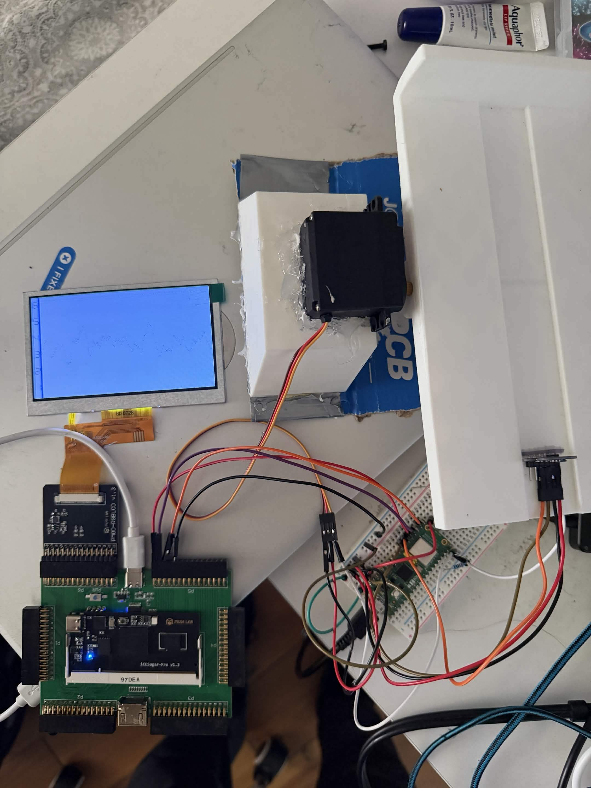
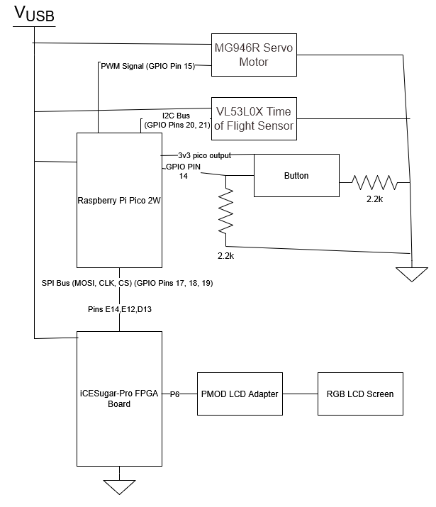
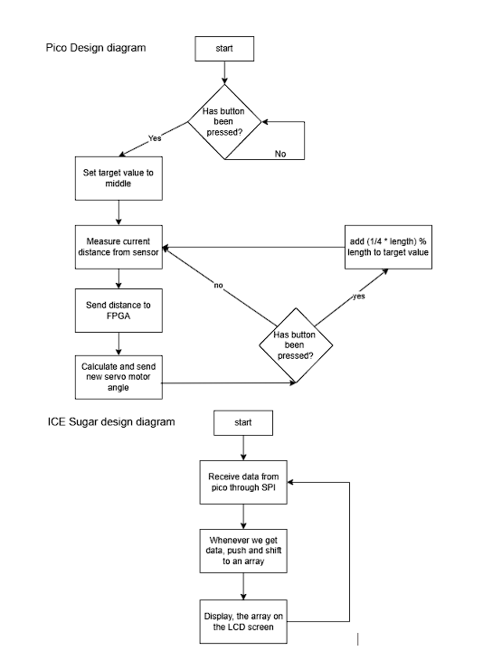

# CS122A Custom Laboratory Project

# PID Seesaw Balancer

**Ricky Vo and Isaiah Tirado**

---

# Introduction

A custom printed seesaw attempts to keep a ball as stationary as possible at the target through PID. The seesaw is tilted through a servo motor.

Our PID constants are:

- **Kp = 0.5**
- **Kd = 0.15**
- **Ki = 0.05**
- **Interval Time = 25 ms**

The default target distance used to keep the ball stationary is set to **3 inches** away from the Time-of-Flight sensor. The target distance can be incremented through a button that also starts the balancing procedure, with implemented value rollover.

The distance of the ball from the sensor is tracked through a graph displayed on a screen powered by the FPGA.

Overall, we found that the constants stated above provided the most consistent performance without causing the ball to enter an unstable state.

### Software Issues

- Potential for the system to become unstable.
- Visual display bugs such as double-printed information.

### Hardware Issue

- The seesaw must be manually held down because it is tilted.

---

# Elements of Complexity

- Accurate PID calculations that cause the ball to balance at the desired target.
- Custom designed graph.
- Custom PLA 3D prints designed in OnShape (first time using the software).

---

# User Guide

1. Reset / Power the MCUs.
2. Hold the seesaw down.
3. Place a tennis ball on the seesaw.
4. Press the button.
5. Let it do its magic.
6. Press the button again to increase the target distance.

---

# Hardware Components Used

- IceSugar / IceSugar-Pro FPGA
- RGB LCD from the required lab components
- Raspberry Pi Pico
- MG946R Servo Motor
- VL53L0X Time-of-Flight Sensor
- Custom 3D Printed PLA Seesaw and Complementary Base

---

# Software Libraries Used

- VL53L0X library by yspreen
- pico_stdlib
- Pico I2C library
- Pico SPI library
- Pico PWM library

---

# Protocols Used

## SPI

Used to send information to the FPGA to display necessary data on the RGB LCD.

Signals used:

- MOSI
- CS
- Clock

## I2C

Used for communication with the VL53L0X Time-of-Flight sensor.

- Device Address: `0x29`

---

# Requirements

### IceSugar / IceSugar-Pro FPGA

Used to power and control the information displayed on the RGB LCD screen.

### RGB LCD

Displays positional information of the ball.

### Raspberry Pi Pico

Controls the servo motor, obtains positional information from the Time-of-Flight sensor, and sends information to the FPGA.

### Event Driven Execution

Has a button that turns on the balancing procedure and increments target distance only when pressed.

---

# Wiring Diagram

---

# Design Diagram

---

# AI Usage

**Ricky:** I used AI for the PWM code and the constraint code by asking Google Search.

---

# Acknowledgements

VL53L0X Driver by yspreen:

https://github.com/yspreen/VL53L0X-driver-pico-sdk-cpp/blob/main/VL53L0X.h

